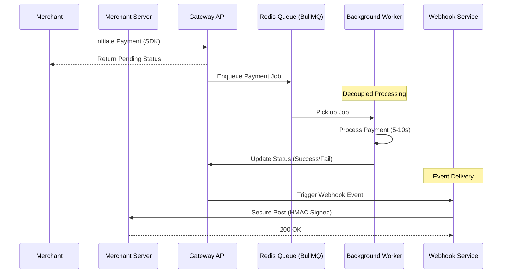

# Payment Gateway Pro: Async & Event-Driven 🚀

[](https://nodejs.org/)
[](https://reactjs.org/)
[](https://redis.io/)
[](https://www.postgresql.org/)
[](https://www.docker.com/)

A high-performance, production-ready payment gateway architecture simulating real-world patterns used by **Stripe**, **Razorpay**, and **PayPal**. This system is built for scale, featuring asynchronous job processing, secure event-driven webhooks, and a seamless developer experience with an embeddable SDK.

---

## Key Highlights

- * Async Processing**: Leverages Redis & BullMQ for non-blocking payment and refund handling.
- * Secure Webhooks**: Event-driven architecture with HMAC-SHA256 signature verification and exponential backoff retries.
- * Idempotent APIs**: Protects against duplicate transactions using a robust idempotency key system.
- * Embeddable SDK**: A lightweight, cross-origin JS SDK for in-context payments via modals/iframes.
- * Real-time Dashboard**: Merchant-first interface for tracking transactions, configuring webhooks, and manual retries.

---

## Visual Tour

<div align="center">
  
  <p><i>Premium Merchant Dashboard with Real-time Analytics</i></p>
  <br>
  
  <p><i>Modern, Responsive Checkout Flow</i></p>
</div>

---

## Architecture & Flow

The system follows a multi-service architecture designed for reliability and decoupling.



---

## Quick Start (1 Command)

Ensure you have **Docker** and **Docker Compose** installed.

```bash
# Clone & Start
git clone https://github.com/NagaSaiTejo/payment-gateway
cd payment-gateway
docker-compose up --build
```

### Services Map
- **Merchant Dashboard**: `http://localhost:3000`
- **Checkout Demo**: `http://localhost:3001`
- **API Server**: `http://localhost:8000`
- **Default Merchant Credentials**:
  - **Email**: `test@example.com`
  - **API Key**: `key_test_abc123`
  - **API Secret**: `secret_test_xyz789`
  - **Webhook Secret**: `whsec_test_abc123`

---

## Tech Stack & Design

### Backend Mastery
- **Engine**: Node.js & Express
- **Queue**: BullMQ (Powered by Redis)
- **DB**: PostgreSQL (Relational schema with ACID compliance)
- **Auth**: JWT & API Key based authentication

### Frontend Excellence
- **Stacks**: React + Vite
- **SDK**: Vanilla JS (Lightweight & Cross-origin aware)
- **Styling**: Premium CSS with smooth transitions and glassmorphism.

### Security First
- **HMAC-SHA256**: For verifying webhook authenticity.
- **Idempotency**: `Idempotency-Key` header support to prevent double billing.
- **Retries**: 5-step exponential backoff (1m, 5m, 30m, 2h, 24h).

---

## Developer Experience (SDK)

Integrate payments with just a few lines of code:

```html
<!-- Load SDK -->
<script src="http://localhost:3001/checkout.js"></script>

<script>
  const checkout = new PaymentGateway({
    key: 'key_test_abc123',
    orderId: 'ORDER_12345',
    onSuccess: (res) => {
      console.log('Payment Successful!', res.paymentId);
    },
    onFailure: (err) => {
      console.error('Payment Failed:', err);
    },
    onClose: () => {
       console.log('Modal Closed');
    }
  });
  
  // Open the hosted checkout modal
  checkout.open();
</script>
```

---

## Reliability Features

### 🔄 Webhook Retry Schedule
If your server is down, we don't give up. The system uses a smart retry logic:
| Attempt | Delay |
| :--- | :--- |
| 1 | Immediate |
| 2 | 1 Minute |
| 3 | 5 Minutes |
| 4 | 30 Minutes |
| 5 | 2 Hours |

### Verify Webhook Signature (Node.js)
```javascript
const crypto = require('crypto');

function verify(payload, signature, secret) {
  const expected = crypto.createHmac('sha256', secret)
                       .update(JSON.stringify(payload))
                       .digest('hex');
  return signature === expected;
}

// In your route handler:
const isValid = verify(req.body, req.headers['x-webhook-signature'], 'whsec_test_abc123');
```

---

## Roadmap
- [ ] **Subscription Engine**: Recurring billing support.
- [ ] **Multi-currency**: Dynamic currency conversion.
- [ ] **Fraud Detection**: AI-powered risk assessment.
- [ ] **GraphQL API**: For more flexible data fetching.

---

## License
  Built by [Naga Sai Tejo](https://github.com/NagaSaiTejo)
